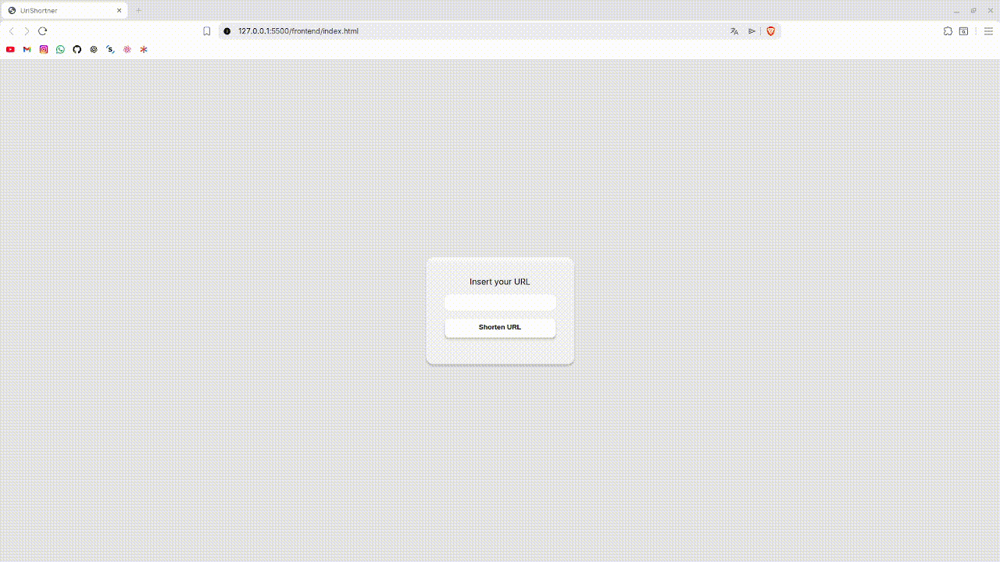

# UrlShortner

> Fullstack URL shortener project that allows creating short links, managing redirects, and tracking access statistics in real time.

## 🧪 Technologies

Here are the technologies used in this project:

* NodeJS;
* PostgreSQL.

## 💻 Prerequisites

Before getting started, make sure you meet the following requirements:
* You installed the latest version of `NodeJS`;
* You have a `<Windows / Linux / Mac>` machine.

## 🚀 Installing UrlShortner

To install UrlShortner, follow these steps:

* Clone the repository: `git clone https://github.com/gabriel-preti-ferraz/UrlShortner`
* Navigate to the project directory: `cd UrlShortner`
* Navigate to the backend: `cd backend`
* Install dependencies: `npm install`

## ☕ Using UrlShortner

To use UrlShortner, follow these steps:

* Navigate to the backend: `cd backend`
* Setup your `.env` file like the `.env-example`
* Start the server: `node .`
* Navigate to the frontend: `cd frontend`
* Setup your `apiUrl` in `script.js`
* Open `index.html` in your browser

## 📫 Contributing to UrlShortner
To contribute to UrlShortner, follow these steps:

1. Fortk this repository;
2. Create a branch: `git checkout -b <branch_name>`;
3. Make your changes and commit them: `git commit -m '<commit_message>'`;
4. Push to the original branch: `git push origin UrlShortner / <local>`;
5. Create a pull request.

Alternatively, refer to GitHub’s documentation on [how to create a pull request](https://help.github.com/en/github/collaborating-with-issues-and-pull-requests/creating-a-pull-request).

## 📝 License

This project is under license. See the archive [LICENSE](LICENSE.md) for more details.

[⬆ Back to top](#UrlShortner) 
